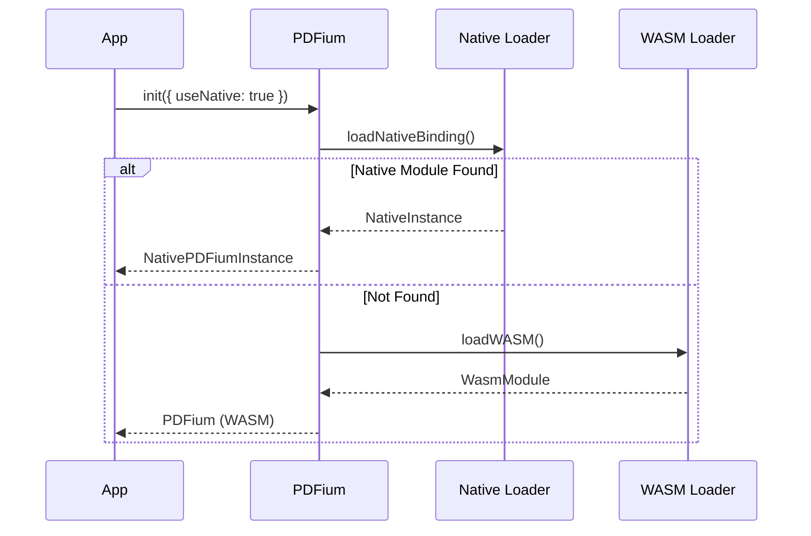

Understanding the library architecture helps you choose the right backend (Native vs WASM) and debug issues. This guide explains how PDFium is wrapped for JavaScript/TypeScript.

## High-Level Overview

The library employs a **Hybrid Architecture** that provides a unified API over two distinct backends:

1.  **Native Backend (Node.js only):** Uses N-API bindings to call the system's compiled PDFium library directly. Fast, zero-overhead, but requires platform-specific binaries.
2.  **WASM Backend (Universal):** Uses a WebAssembly-compiled version of PDFium. Portable, works in browsers and Node.js, but has slight marshalling overhead.

```mermaid
graph TD
    subgraph App[Your Application]
        Code[Your Code]
    end

    subgraph Wrapper[@scaryterry/pdfium]
        API[PDFium Class]
        Doc[PDFiumDocument]
        Page[PDFiumPage]
    end

    subgraph Backends[Backend Selection]
        Switch{Native or WASM?}
        Native[Native Backend]
        WASM[WASM Backend]
    end

    subgraph Implementation[Implementation Layer]
        NAPI[N-API Bindings]
        Emscripten[Emscripten Runtime]
    end

    subgraph Core[PDFium Core]
        Lib[libpdfium.so / .dll / .dylib]
        WasmBin[pdfium.wasm]
    end

    Code --> API
    API --> Switch
    
    Switch -- "useNative: true" --> Native
    Switch -- "Default" --> WASM
    
    Native --> NAPI
    WASM --> Emscripten
    
    NAPI --> Lib
    Emscripten --> WasmBin
```

## Backend Selection Flow



## Component Layers

### 1. The Unified API Layer
Regardless of the backend, you interact with similar high-level interfaces:
- `PDFiumDocument` (WASM) / `NativePDFiumDocument` (Native)
- `PDFiumPage` (WASM) / `NativePDFiumPage` (Native)

This allows you to write code that is largely portable between Node.js (Native) and the Browser (WASM), though some advanced features (forms, creation) are currently WASM-only.

### 2. Native Backend (Node.js)
- **Implementation:** `src/native/`
- **Dependencies:** Platform-specific npm packages (e.g., `@scaryterry/pdfium-darwin-arm64`).
- **Performance:** Direct C++ calls. No memory copying for some operations.
- **Limitations:** Only works in Node.js environments.

### 3. WASM Backend (Universal)
- **Implementation:** `src/wasm/`
- **Dependencies:** None (WASM binary is bundled).
- **Performance:** Near-native, but incurs overhead when copying image data between WASM heap and JS memory.
- **Capabilities:** Runs everywhere (Node.js, Browsers, Workers).

## Memory Architecture (WASM)

The WASM backend requires manual memory management because WebAssembly memory is linear and manual. The wrapper handles this automatically using the `Disposable` pattern.


## Handle System

Both backends use a "Handle" system to track pointers to underlying C++ objects.

| Handle Type | C++ Type | Description |
|-------------|----------|-------------|
| `DocumentHandle` | `FPDF_DOCUMENT` | Pointer to an open document |
| `PageHandle` | `FPDF_PAGE` | Pointer to a loaded page |
| `BitmapHandle` | `FPDF_BITMAP` | Pointer to a pixel buffer |

**Safety:** These handles are "branded types" in TypeScript to prevent you from accidentally passing a Page handle to a function expecting a Document handle.

## Platform Differences

| Feature | Native Backend | WASM Backend |
|---------|---------------|--------------|
| **Environment** | Node.js Only | Browsers & Node.js |
| **Setup** | Install platform pkg | Zero config |
| **Performance** | Maximum | High |
| **Worker Support** | Node.js Worker Threads | Web Workers & Worker Threads |
| **Memory Limit** | System RAM | Browser/WASM Limit (often 2GB/4GB) |

## See Also

- [Installation](/pdfium/installation/) — Installing native packages
- [Performance](/pdfium/concepts/performance/) — Benchmarking backends
